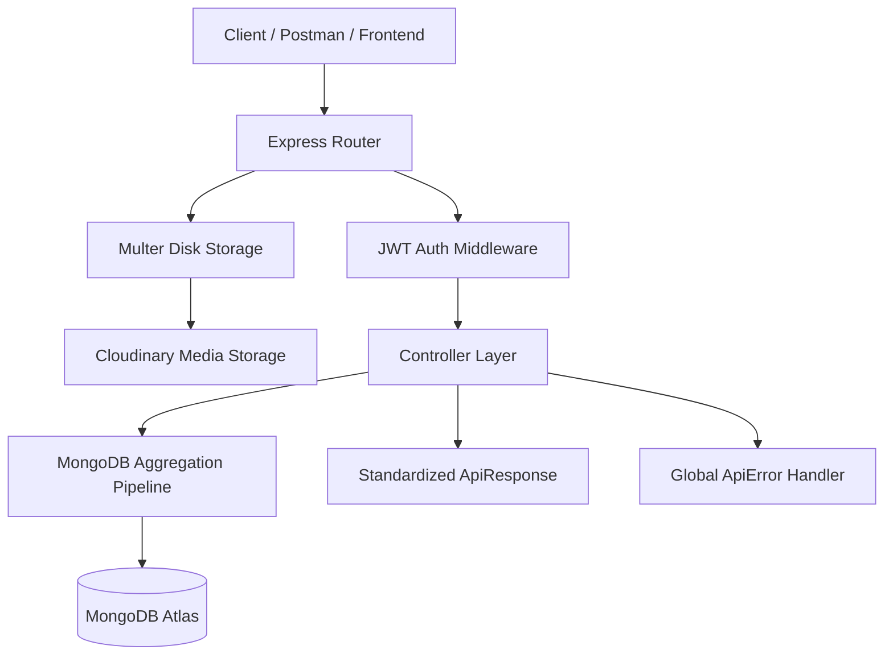

# VideoTube — Backend API

[](https://nodejs.org/)
[](https://expressjs.com/)
[](https://www.mongodb.com/)
[](https://jwt.io/)
[](https://cloudinary.com/)
[](https://sujal2156-6399282.postman.co/workspace/b8dd5b58-e9c0-4a95-8b77-6b30247ab5f6/collection/51711749-ff38c81f-e69e-40ca-9394-37d5543281d2?action=share&source=copy-link&creator=51711749)

A complete RESTful backend API for a video sharing and streaming platform, built with Node.js, Express, MongoDB, and Cloudinary. It includes user authentication with access/refresh tokens, video uploads with duration calculation, watch history, subscriptions, likes, comments, playlists, community posts (tweets), and creator channel analytics.

---

## 🔗 Quick Links

- **Live Postman Documentation**: [View Collection in Postman Workspace ↗](https://sujal2156-6399282.postman.co/workspace/b8dd5b58-e9c0-4a95-8b77-6b30247ab5f6/collection/51711749-ff38c81f-e69e-40ca-9394-37d5543281d2?action=share&source=copy-link&creator=51711749)
- **Local Postman File**: [`VideoTube_Postman_Collection.json`](./VideoTube_Postman_Collection.json)
- **Environment Template**: [`.env.sample`](./.env.sample)

---

## ⚡ Core Features

- **Authentication & Security**: Dual-token authentication (Access Token + Refresh Token), bcrypt password hashing, and cookie-based session handling.
- **Media Upload Pipeline**: File uploads handled via Multer and stored on Cloudinary (avatars, cover images, video files, thumbnails).
- **MongoDB Aggregation Pipelines**: Multi-stage `$lookup`, `$facet`, and `$cond` pipelines for channel profiles, watch history, liked video lists, and subscriber metrics.
- **Pagination**: Implemented across video listings and comments using `mongoose-aggregate-paginate-v2`.
- **Creator Dashboard**: Real-time channel stats including total video views, subscriber count, total videos, and total likes.
- **Error Handling**: Custom `ApiError` and standardized `ApiResponse` wrappers with global error-handling middleware.

---

## 🏗 Architecture & Flow



---

## 📁 Folder Structure

```
├── public/temp/             # Temporary local storage for Multer uploads
├── src/
│   ├── controllers/         # Request handling & aggregation logic
│   │   ├── comment.controller.js
│   │   ├── dashboard.controller.js
│   │   ├── healthcheck.controller.js
│   │   ├── like.controller.js
│   │   ├── playlist.controller.js
│   │   ├── subscription.controller.js
│   │   ├── tweet.controller.js
│   │   ├── user.controller.js
│   │   └── video.controller.js
│   ├── db/                  # Database connection setup
│   ├── middlewares/         # JWT verification & Multer config
│   ├── models/              # Mongoose schemas (User, Video, Comment, Like, Playlist, Tweet, Subscription)
│   ├── routes/              # Express route declarations
│   ├── utils/               # ApiError, ApiResponse, asyncHandler, Cloudinary helpers
│   ├── app.js               # Express app configuration & middleware pipeline
│   ├── constants.js         # Application constants (DB name)
│   └── index.js             # App entry point & server bootstrap
├── .env.sample              # Environment variables template
├── VideoTube_Postman_Collection.json # Postman collection with tests
└── package.json
```

---

## 📋 API Endpoints Overview

Base URL: `http://localhost:8000/api/v1`

### 1. Healthcheck (`/healthcheck`)
- `GET /` — Check server status

### 2. Users & Authentication (`/users`)
- `POST /register` — Register user with avatar & cover image
- `POST /login` — Authenticate user and issue tokens
- `POST /logout` — Log out user and clear tokens
- `POST /refresh-token` — Regenerate access token
- `POST /change-password` — Change password for logged-in user
- `GET /current-user` — Get logged-in user profile
- `PATCH /update-account` — Update full name & email
- `PATCH /avatar` — Update avatar image
- `PATCH /cover-image` — Update cover banner
- `GET /c/:username` — Get channel profile with subscriber statistics
- `GET /history` — Get user watch history

### 3. Videos (`/videos`)
- `GET /` — Get all videos (Search query, pagination, sorting)
- `POST /` — Publish new video with thumbnail
- `GET /:videoId` — Get video details & increment view count
- `PATCH /:videoId` — Update video metadata or thumbnail
- `DELETE /:videoId` — Delete video and linked likes/comments
- `PATCH /toggle/publish/:videoId` — Toggle publish status

### 4. Comments (`/comments`)
- `GET /:videoId` — Get paginated video comments with like status
- `POST /:videoId` — Add comment to video
- `PATCH /c/:commentId` — Update comment
- `DELETE /c/:commentId` — Delete comment

### 5. Likes (`/likes`)
- `POST /toggle/v/:videoId` — Toggle like on a video
- `POST /toggle/c/:commentId` — Toggle like on a comment
- `POST /toggle/t/:tweetId` — Toggle like on a tweet
- `GET /videos` — Get all liked videos of the user

### 6. Playlists (`/playlists`)
- `POST /` — Create playlist
- `GET /:playlistId` — Get playlist by ID with video details
- `PATCH /:playlistId` — Update playlist title or description
- `DELETE /:playlistId` — Delete playlist
- `PATCH /add/:videoId/:playlistId` — Add video to playlist
- `PATCH /remove/:videoId/:playlistId` — Remove video from playlist
- `GET /user/:userId` — Get all playlists of a user

### 7. Subscriptions (`/subscriptions`)
- `POST /c/:channelId` — Toggle subscribe / unsubscribe
- `GET /c/:channelId` — Get list of channel subscribers
- `GET /u/:subscriberId` — Get list of channels subscribed by user

### 8. Tweets / Community Posts (`/tweets`)
- `POST /` — Create tweet
- `GET /user/:userId` — Get user tweets with likes count
- `PATCH /:tweetId` — Update tweet
- `DELETE /:tweetId` — Delete tweet

### 9. Dashboard (`/dashboard`)
- `GET /stats` — Get total views, subscribers, videos, and likes
- `GET /videos` — Get all videos uploaded by the creator

---

## 🛠 Getting Started

### 1. Clone the repo
```bash
git clone https://github.com/Sujal2156/VideoTube-Backend.git
cd VideoTube-Backend
```

### 2. Install dependencies
```bash
npm install
```

### 3. Set up environment variables
Create a `.env` file in the root directory (refer to `.env.sample`):
```env
PORT=8000
MONGODB_URI=your_mongodb_connection_string
CORS_ORIGIN=*
ACCESS_TOKEN_SECRET=your_jwt_access_secret
ACCESS_TOKEN_EXPIRY=1d
REFRESH_TOKEN_SECRET=your_jwt_refresh_secret
REFRESH_TOKEN_EXPIRY=10d

CLOUDINARY_CLOUD_NAME=your_cloudinary_name
CLOUDINARY_API_KEY=your_cloudinary_key
CLOUDINARY_API_SECRET=your_cloudinary_secret
```

### 4. Run the server
```bash
# Development (with nodemon)
npm run dev

# Production
npm start
```

---

## 🧪 Testing with Postman

1. Import [`VideoTube_Postman_Collection.json`](./VideoTube_Postman_Collection.json) into Postman or Thunder Client (or use the [Live Postman Workspace link](https://sujal2156-6399282.postman.co/workspace/b8dd5b58-e9c0-4a95-8b77-6b30247ab5f6/collection/51711749-ff38c81f-e69e-40ca-9394-37d5543281d2?action=share&source=copy-link&creator=51711749)).
2. Run `01 - Users & Authentication > 2. Login User`. The `ACCESS_TOKEN` is automatically captured and injected into subsequent protected requests.

---

## 📄 License
ISC License
